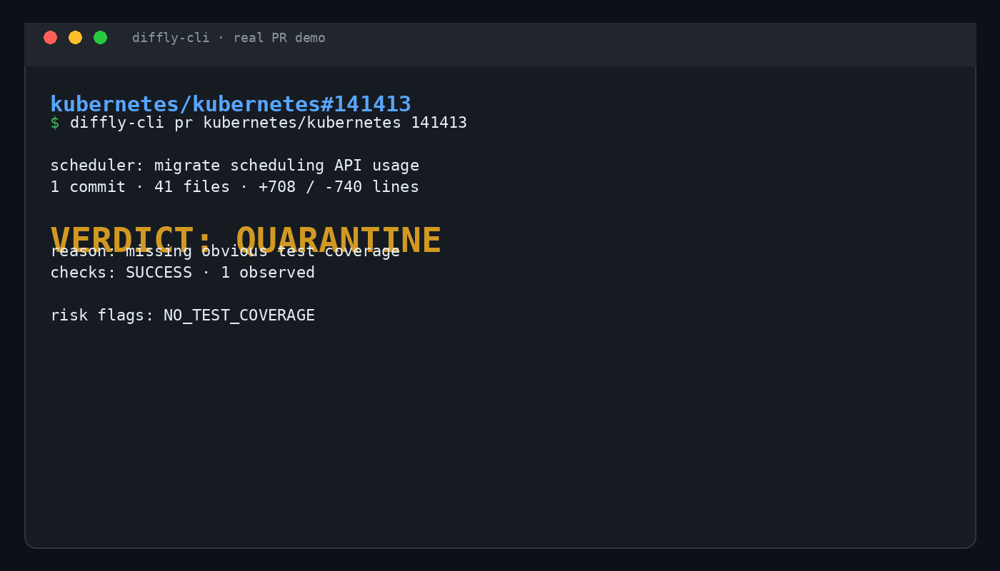
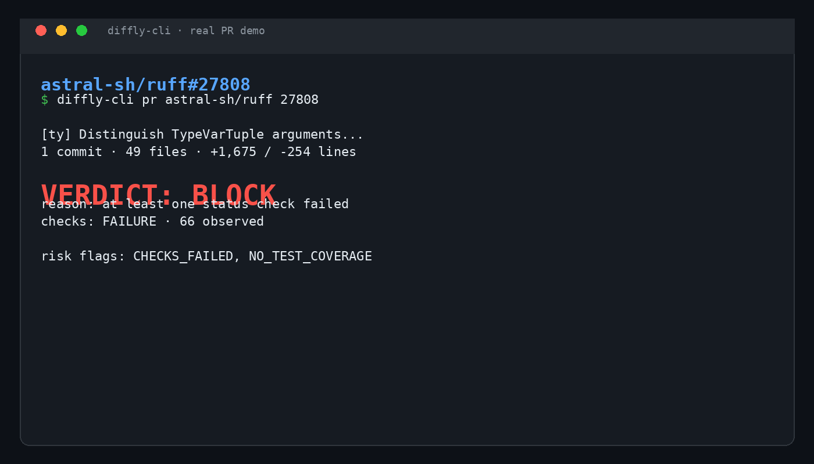

# diffly-cli

**diffly-cli** is a deterministic, terminal-first triage tool for large GitHub pull requests. It fetches the pull request metadata, changed files, unified diff, commit metadata, status checks, and repository tree; parses supported source changes with Tree-sitter; identifies a conservative blast-radius map; applies fixed risk rules; and emits a one-page Markdown review with a `SHIP`, `QUARANTINE`, or `BLOCK` verdict.

This release includes **Phase 1 deterministic triage** plus the optional **Phase 2 literate-diff explainer**. Deterministic facts and verdicts remain authoritative; generated prose is clearly labeled and cannot change `SHIP`, `QUARANTINE`, or `BLOCK`.

## Why it exists

Large AI-generated pull requests can be difficult to review because file-by-file diffs hide the affected symbols, adjacent tests, dependency changes, and high-risk surfaces. diffly-cli makes the deterministic part of that review visible before an LLM is introduced.

## Install

Requirements are Python 3.10 or newer. The installer creates an isolated environment under `~/.local/share/diffly-cli`, installs the package and its dependencies, and links the command into `~/.local/bin`.

```bash
curl -fsSL https://raw.githubusercontent.com/VIVAAN-DHAWAN/diffly-cli/main/install.sh | sh
```

That is the complete installation. If `diffly-cli` is not immediately found afterward, add `~/.local/bin` to your `PATH` and open a new shell. No GitHub CLI installation is required.

A GitHub token is optional for light public use, but authenticated requests provide much higher API limits:

```bash
export GITHUB_TOKEN="github_pat_..."
```

## Usage

```bash
diffly-cli pr <owner/repo> <pr-number>
```

Add the optional literate-diff explanation with an OpenAI-compatible BYOK endpoint:

```bash
export DIFFLY_LLM_API_KEY="your-key"
export DIFFLY_LLM_BASE_URL="https://api.openai.com/v1"  # omit for the configured default endpoint
diffly-cli pr <owner/repo> <pr-number> --explain
```

The default model is `gpt-5-mini`; override it with `DIFFLY_LLM_MODEL` or `--llm-model`. The explainer sends bounded, redacted context, requires strict JSON output, rejects citations to files outside the changed-file set, and fails safely back to deterministic triage when no key is configured or the model response is invalid. Use `--json` with `--explain` to receive the structured literate-diff object.

Examples:

```bash
diffly-cli pr pallets/urllib3 3456
diffly-cli pr pallets/urllib3 3456 --output triage.md
diffly-cli pr pallets/urllib3 3456 --json
```

The command prints clean terminal Markdown by default. `--json` is provided for CI integration and `--output` saves the Markdown report to a file.

## Deterministic policy

| Verdict | Rule |
| --- | --- |
| **BLOCK** | A required check failed, or the pull request touches authentication, credentials, secrets, or security-sensitive files. |
| **QUARANTINE** | The pull request changes database schema or migrations, adds or changes dependencies, lacks obvious test coverage for a production file, or has unavailable/pending checks. |
| **SHIP** | No deterministic rule fired and observed checks passed. |

The policy is deliberately conservative. A verdict is a review gate, not a claim that a pull request is correct or safe in every context.

## What the blast-radius map contains

For each changed file, the report lists the file status, additions and deletions, changed symbols detected from supported source languages, direct call sites visible in changed hunks, and related test files discovered from the repository tree. The Phase 1 map is intentionally conservative: a full repository-wide call graph and cross-file symbol resolution are future work.

## Demo

The committed demo section is captured from real terminal sessions running diffly-cli against public GitHub pull requests. It records the raw diff statistics beside diffly-cli’s actual one-page deterministic summary; the screenshots and GIF are rendered from those terminal transcripts rather than generated mockups. These figures are dated captures of public pull requests, whose metadata and checks may change after capture.


The same demos are available as standalone screenshots for sharing or issue discussions:

| Pull request | Screenshot |
| --- | --- |
| `microsoft/vscode#330848` |  |
| `kubernetes/kubernetes#141413` |  |
| `astral-sh/ruff#27808` |  |

### Demo A: microsoft/vscode#330848

Raw GitHub PR statistics: **25 files**, **+2,557 / -251 lines**, **25 commits**. The one-page deterministic summary produced by diffly-cli is:

```text
Title: sessions: Add grid layout for chats
Checks: SUCCESS (27 observed)
Verdict: QUARANTINE
Reason: at least one changed production file lacks obvious test coverage
Risk flags: NO_TEST_COVERAGE
Blast radius: 25 changed files; changed symbols and direct callers listed per file
```

Full generated report: [`demo/vscode-330848.md`](demo/vscode-330848.md).

### Demo B: kubernetes/kubernetes#141413

Raw GitHub PR statistics at capture time: **41 files**, **+708 / -740 lines**, **1 commit**. The tool returned `QUARANTINE` because at least one changed production file lacked obvious test coverage and the observed check state included a pending `tide` result.

Full generated report: [`demo/kubernetes-141413.md`](demo/kubernetes-141413.md).

### Demo C: astral-sh/ruff#27808

Raw GitHub PR statistics: **49 files**, **+1,675 / -254 lines**, **1 commit**. The tool returned `BLOCK` because observed checks failed, including CodSpeed and benchmark jobs.

Full deterministic report: [`demo/ruff-27808.md`](demo/ruff-27808.md).

### Phase 2 live literate-diff demos

The following reports were generated from live `gpt-5-mini` calls using bounded, redacted context from real public pull requests:

- [`demo/ruff-27808-phase2.md`](demo/ruff-27808-phase2.md): generated narrative for a 49-file Ruff pull request while preserving the deterministic `BLOCK` verdict.
- [`demo/kubernetes-141413-phase2.md`](demo/kubernetes-141413-phase2.md): generated narrative for a 41-file Kubernetes pull request while preserving the deterministic `QUARANTINE` verdict.

## Current limitations

The Phase 2 explainer is optional and requires an OpenAI-compatible API key. It is not a substitute for human review and its prose is not allowed to influence the deterministic verdict. Tree-sitter parsing currently focuses on symbols and direct calls visible in changed hunks, not a complete repository-wide reachability graph. Test coverage detection is heuristic and based on filenames and repository-tree evidence. GitHub checks are summarized from check runs and commit statuses; unavailable checks are quarantined rather than inferred to be passing. The model context is bounded and may be truncated for unusually large pull requests.

## Roadmap

Future work includes repository-wide symbol resolution, stronger test-to-production coverage mapping, configurable organization policies, and optional provider-specific adapters. The Phase 2 contract and safety boundary are documented in [`docs/phase-2-contract.md`](docs/phase-2-contract.md).

## License

Released under the [MIT License](LICENSE).
