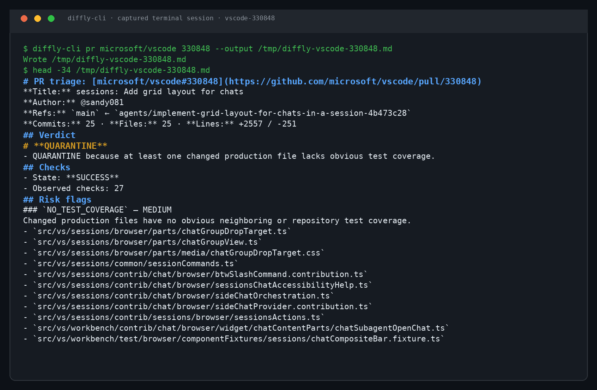

<p align="center">
  
</p>

# ⚡ diffly

<p align="center">
  <b>Your PR is 4,000 lines long. Nobody wants to review it.</b><br>
  diffly reads it for you — files, symbols, checks, tests, blast radius —<br>
  and hands you one page and one verdict: <b>PASS</b>, <b>QUARANTINE</b>, or <b>BLOCK</b>.
</p>

<p align="center">
  <a href="https://github.com/VIVAAN-DHAWAN/diffly-cli/actions/workflows/ci.yml"></a>
  <a href="https://github.com/VIVAAN-DHAWAN/diffly-cli/releases/latest"></a>
  <a href="https://www.python.org/"></a>
  <a href="LICENSE"></a>
</p>

---

## Install

Pick whichever fits your setup:

**curl (recommended)**
```bash
curl -fsSL https://raw.githubusercontent.com/VIVAAN-DHAWAN/diffly-cli/main/install.sh | sh
```

**pip**
```bash
pip install diffly-cli
```
**uv**
```bash
uv tool install diffly-cli
```

**Homebrew**
```bash
brew install VIVAAN-DHAWAN/diffly-cli/diffly-cli
```

That's it. If `diffly` isn't found, add `~/.local/bin` to your `PATH` (curl/pip/uv) and open a new shell.

### Upgrading from pre-0.4.0

If you already have diffly installed but are on a version before 0.4.0 (which introduced the built-in update system), run the one-time upgrade script:

```bash
curl -fsSL https://raw.githubusercontent.com/VIVAAN-DHAWAN/diffly-cli/main/upgrade.sh | sh
```

This pulls in 0.4.0+, which has `diffly update` built in. From that point on, diffly will automatically check for new releases every time you run it and prompt you to update — no more manual upgrades needed.

## Updating

From 0.4.0 onwards, just run:

```bash
diffly update
```

Or simply start diffly normally — it will check for updates on launch and ask if you'd like to install the latest version. You can also choose to enable automatic updates so future versions install silently.

## Try it in 10 seconds

```bash
diffly pr https://github.com/astral-sh/ruff/pull/27808
```

Paste any pull-request URL — or run bare `diffly` for a guided flow. You'll get a keyboard-driven, one-page review: verdict, risk flags, checks, and a per-file blast-radius map. Arrow keys move, space toggles sections, Enter renders, `q` quits.



---

## What diffly actually does

Large AI-generated pull requests are hard to review because file-by-file diffs hide what matters: which symbols changed, which tests cover them, whether dependencies moved, whether a security-sensitive file was touched. diffly makes the deterministic part of that review visible **before** any LLM gets involved.

It fetches the PR metadata, changed files, unified diff, commits, status checks, and repository tree; parses source changes with Tree-sitter; maps the blast radius; applies fixed risk rules; and emits a one-page Markdown report with a verdict.

<table>
<tr><td><b>One-page verdicts</b></td><td><code>PASS</code>, <code>QUARANTINE</code>, or <code>BLOCK</code> from fixed, documented rules. Same PR data in, same verdict out — every time.</td></tr>
<tr><td><b>Blast-radius map</b></td><td>Per file: status, additions/deletions, touched symbols, direct callers visible in changed hunks, and related test files discovered from the repository tree.</td></tr>
<tr><td><b>Risk flags</b></td><td>Auth/secrets touches, database changes, new dependencies, missing test coverage, failed or pending checks — each with severity and evidence.</td></tr>
<tr><td><b>Works offline</b></td><td><code>diffly local</code> triages git changes in any folder on disk — private, archived, or removed repositories included.</td></tr>
<tr><td><b>CI-native</b></td><td>Bundled GitHub Action posts one self-updating verdict comment on every PR. Stable JSON output for scripts.</td></tr>
<tr><td><b>Optional AI explainer</b></td><td>Bring your own OpenAI-compatible key for a generated narrative — sandboxed, redacted, strictly validated, and never allowed to change the verdict.</td></tr>
</table>

## Local mode — no GitHub required

Analyze git changes on your own disk. No token, no network:

```bash
diffly local                      # uncommitted working-tree changes in the current folder
diffly local ~/code/private-repo  # any checkout — even repos deleted from GitHub
diffly local --base main          # compare your branch against main instead
```

Untracked files are included, so brand-new work is never silently ignored. CI checks don't exist locally, so check-derived flags are skipped; everything else behaves exactly as it does for pull requests.

## GitHub Action

Add this to analyze every pull request automatically:

```yaml
name: Diffly
on: pull_request
permissions:
  contents: read
  pull-requests: write
jobs:
  diffly:
    runs-on: ubuntu-latest
    steps:
      - uses: VIVAAN-DHAWAN/diffly-cli@main
```

To enable the optional explainer in CI, add `DIFFLY_LLM_API_KEY: ${{ secrets.DIFFLY_LLM_API_KEY }}` under the step's `env`. Without a key, the Action runs deterministic-only.

## Everyday commands

```bash
diffly                                          # guided wizard
diffly pr astral-sh/ruff 27808                  # owner/repo + number
diffly pr https://github.com/astral-sh/ruff/pull/27808   # just paste the URL
diffly pr astral-sh/ruff 27808 --interactive    # keyboard-driven review
diffly pr astral-sh/ruff 27808 --output triage.md
diffly pr astral-sh/ruff 27808 --json           # stable JSON for scripts
diffly setup                                    # guided tutorial
diffly doctor                                   # environment diagnostics
diffly update                                   # check for and install the latest release
```

For automation prefer `--json`: successful triage exits `0` regardless of verdict — enforce policy by reading the `verdict` field. Operational errors exit `2`.

### Optional AI explanation

```bash
export DIFFLY_LLM_API_KEY="your-key"
export DIFFLY_LLM_BASE_URL="https://api.openai.com/v1"  # omit for the default endpoint
diffly pr OWNER/REPO NUMBER --explain
```

Default model is `gpt-5-mini`; override with `DIFFLY_LLM_MODEL` or `--llm-model`. The explainer sends bounded, redacted context, requires strict JSON output, rejects citations to files outside the changed-file set, and fails safely back to deterministic triage when anything is off.

## The verdict policy

| Verdict | Rule |
| --- | --- |
| **BLOCK** | A required check failed, or the PR touches authentication, credentials, secrets, or security-sensitive files. |
| **QUARANTINE** | Database schema/migrations, dependency changes, missing obvious test coverage for production files, or unavailable/pending checks. |
| **PASS** | No rule fired and observed checks passed. `SHIP` remains accepted as a legacy alias. |

Deliberately conservative: a verdict is a review gate, not a claim that a PR is correct or safe in every context.

## Real examples

Captured from live terminal sessions against public pull requests:

| Pull request | Files | Lines | Verdict | Why |
| --- | --- | --- | --- | --- |
| [`microsoft/vscode#330848`](demo/vscode-330848.md) | 25 | +2,557 / -251 | QUARANTINE | production files without obvious test coverage |
| [`kubernetes/kubernetes#141413`](demo/kubernetes-141413.md) | 41 | +708 / -740 | QUARANTINE | missing coverage + pending `tide` check |
| [`astral-sh/ruff#27808`](demo/ruff-27808.md) | 53 | +1,845 / -274 | BLOCK | `CodSpeed Performance Analysis` check failed |

Standalone screenshots: [vscode](assets/screenshots/vscode-330848.png) · [kubernetes](assets/screenshots/kubernetes-141413.png) · [ruff](assets/screenshots/ruff-27808.png)

Live AI-explainer reports (deterministic verdict preserved): [ruff phase 2](demo/ruff-27808-phase2.md) · [kubernetes phase 2](demo/kubernetes-141413-phase2.md)

## Current limitations

The Phase 2 explainer requires an OpenAI-compatible API key and never influences the verdict. Tree-sitter parsing covers symbols and direct calls visible in changed hunks, not a full repository-wide call graph. Test-coverage detection is heuristic (filenames + repository tree). Unavailable checks are quarantined rather than assumed passing. Model context is bounded and may truncate on very large PRs.

## Roadmap

- repository-wide symbol resolution and import-aware blast radius;
- configurable policy files for org-specific risk rules and thresholds;
- GitHub annotations and check-run output alongside the PR comment;
- baseline mode reporting only risks introduced vs the target branch;
- coverage-artifact-based test mapping;
- SARIF output for code-scanning integrations.

Details: [`docs/phase-2-contract.md`](docs/phase-2-contract.md) · [`docs/benchmarks.md`](docs/benchmarks.md)

## Development

```bash
git clone https://github.com/VIVAAN-DHAWAN/diffly-cli.git
cd diffly-cli
python -m venv .venv
. .venv/bin/activate
python -m pip install -e '.[dev]'
pytest -q
```

Keep changes focused, include regression tests, and record user-facing changes in [`CHANGELOG.md`](CHANGELOG.md). See [`CONTRIBUTING.md`](CONTRIBUTING.md).

## Security & privacy

Diffly talks to the GitHub API only for the repo and PR you point it at. Deterministic mode sends no code to any LLM. With `--explain`, bounded redacted context goes to your configured endpoint — read [`docs/phase-2-contract.md`](docs/phase-2-contract.md) before enabling it on sensitive repositories. Prefer environment variables over command-line tokens.

Report vulnerabilities privately via [GitHub security advisories](https://github.com/VIVAAN-DHAWAN/diffly-cli/security/advisories/new).

## License

Released under the [MIT License](LICENSE).
